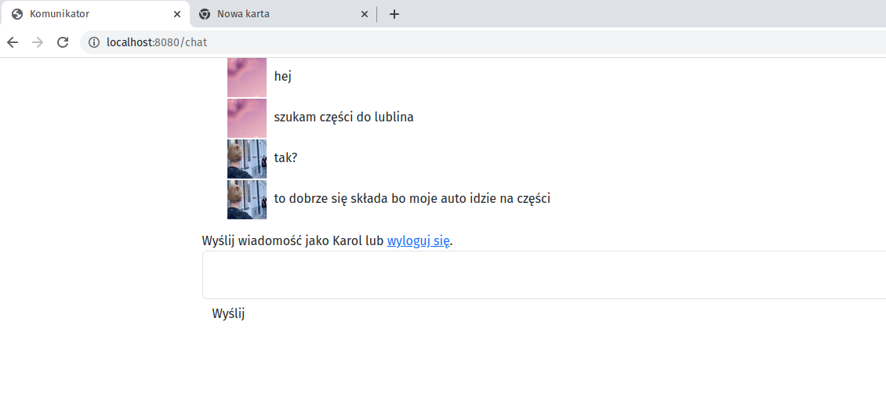

# go-chat

One room chat app and authorization from facebook, github and google

## Browser path

- localhost:8080/chat

- localhost:808/upload

## Run Locally

Clone the project

```bash
  git clone https://github.com/errsync/go-chat.git
```

Go to the project directory

```bash
  cd go-chat
```

Change in authkey file authentication varaiables

Install dependencies

```bash
  go build -o chat.exe
```

Start the server

```bash
  ./chate.exe
```

## Screenshots


